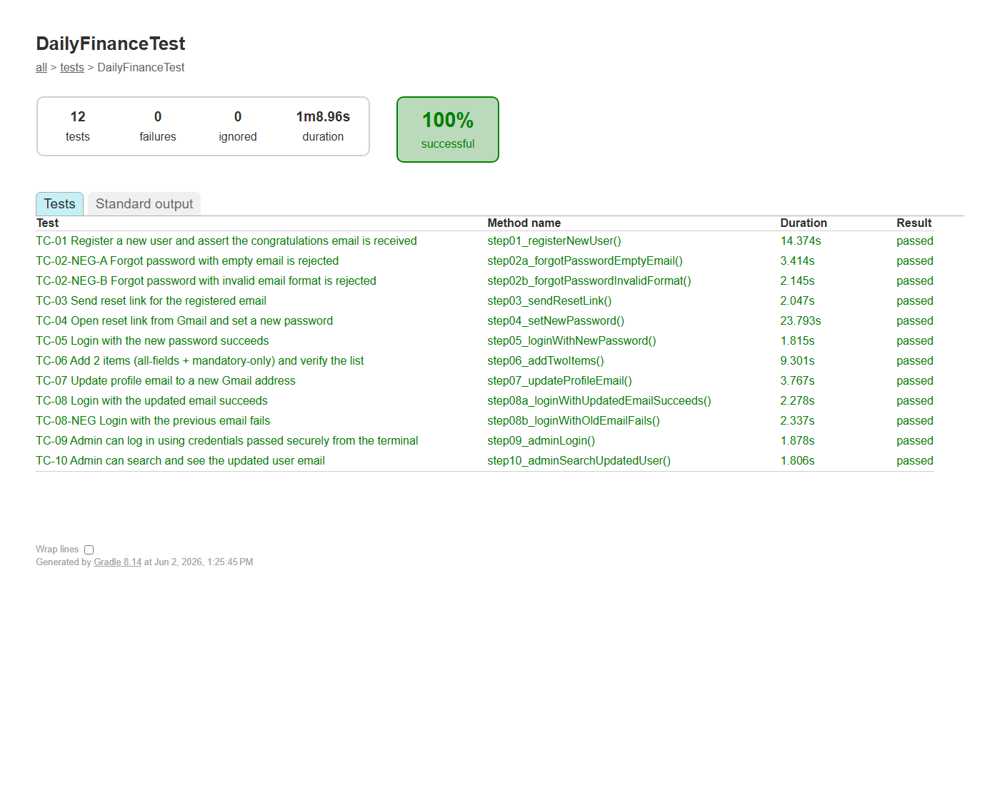

# Assignment 4 — Playwright Automation (Batch 18)

End-to-end UI automation of the **DailyFinance** SPA using **Playwright for Java** on a
clean **Page Object Model** architecture.

**Website under test:** https://dailyfinance.roadtocareer.net/

---

## What it does (10 ordered steps / 12 JUnit tests)

1. **Register** a fresh `nusratrita00+{random}@gmail.com` user and **assert the congratulations email is received**.
2. Two **negative** forgot-password cases — empty email and invalid format.
3. Send a real **reset link** to the registered Gmail and assert the confirmation.
4. Paste the reset link from Gmail into a dialog, then **set a new password**.
5. **Login** with the new password.
6. Add **2 items** — one with **all fields**, one with **mandatory fields only** — and assert both appear in the item list.
7. **Update the profile email** to a new Gmail and verify the change **persisted**.
8. Assert login with the **updated** email **succeeds** and login with the **previous** email **fails**.
9. **Admin login** using credentials supplied securely from the terminal (`-Dadmin.email`, `-Dadmin.password`).
10. **Search** the updated user email on the admin dashboard and assert the matching row appears.

> **Result of a full run:** all 12 ordered tests pass.

---

## Architecture (POM)

```
src/test/java/
├── pages/   # Page Objects: BasePage + Register, Login, ForgotPassword,
│            #               ResetPassword, Dashboard, AddItem, ItemList,
│            #               Profile, AdminUsers
├── utils/   # PlaywrightFactory, ConfigReader, RandomDataGenerator,
│            # ConsoleHelper, ScreenshotUtil, TestContext
└── tests/   # DailyFinanceTest.java (12 ordered tests)
```

### Implementation note (SPA quirk)
The profile is a client-rendered React SPA. After navigating to the profile view, the
page object performs a **one-time hard refresh** before editing — without it, an Update
submitted against the not-yet-fully-bound form is silently dropped (no error, change not
saved). Admin login lands on the `/admin` user table, detected via the always-present
"Search by any field or date…" box.

---

## How to run

### Prerequisites
- **Java JDK 17+**
- **Google Chrome** installed (used via Playwright's `chrome` channel — no browser download).
  If Chrome is unavailable, run `./gradlew installPlaywright` once to fetch bundled Chromium.

### Run the suite
Admin credentials are passed as `-D` system properties — **never committed**:

```powershell
.\gradlew test "-Dadmin.email=admin@test.com" "-Dadmin.password=admin123"
```

> In **PowerShell** the whole `-D...` token must be quoted (starting at `-D`), otherwise
> the shell splits it and Gradle treats the fragment as a bogus task name.
>
> If Gradle reports the tests as `UP-TO-DATE` and the browser doesn't open, force a real
> run with `cleanTest`:
> ```powershell
> .\gradlew cleanTest test "-Dadmin.email=admin@test.com" "-Dadmin.password=admin123"
> ```

### Interactive steps during the run
- **Step 1** — a dialog asks you to confirm the *congratulations email* arrived in Gmail. Click **YES** once you see it.
- **Step 4** — a dialog (always-on-top) asks you to paste the *password-reset link* from Gmail. Copy it from the inbox, paste, click **OK**.

### View the HTML report
After the run, open:
```
build/reports/tests/test/index.html
```

### Recorded automation video
Playwright records the full run to `videos/` automatically. A screen-recording of the
process is also uploaded to Drive (link below).

---

## Submission artifacts

### Recorded Video
[Automation Video](https://drive.google.com/drive/folders/1nYuy_kK0ynPfw3nrPDKzs0KTFvQLHdJd?usp=sharing)

### Test Report Screenshot
<!-- Add the report screenshot after a run (build/reports/tests/test/index.html) -->


### Test Cases
Standard test-case spec: [docs/TestCases.md](docs/TestCases.md)

---

## Tech Stack
- **Java 17+** — language
- **Playwright for Java 1.49.0** — browser automation (auto-waiting, video recording)
- **JUnit 5 (Jupiter)** — test framework
- **AssertJ 3.26** — fluent assertions
- **Apache Commons Lang3** — random test data
- **Gradle (Kotlin DSL)** — build tool + built-in HTML test report

## Gitignored (housekeeping)
`build/`, `.gradle/`, `.idea/`, `videos/`, per-step `screenshots/dailyfinance/`, and the
local `src/test/resources/config.properties` (only the `.example` template is committed).
